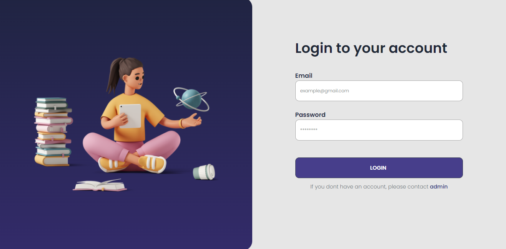
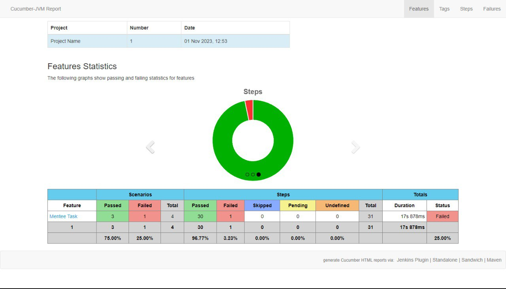
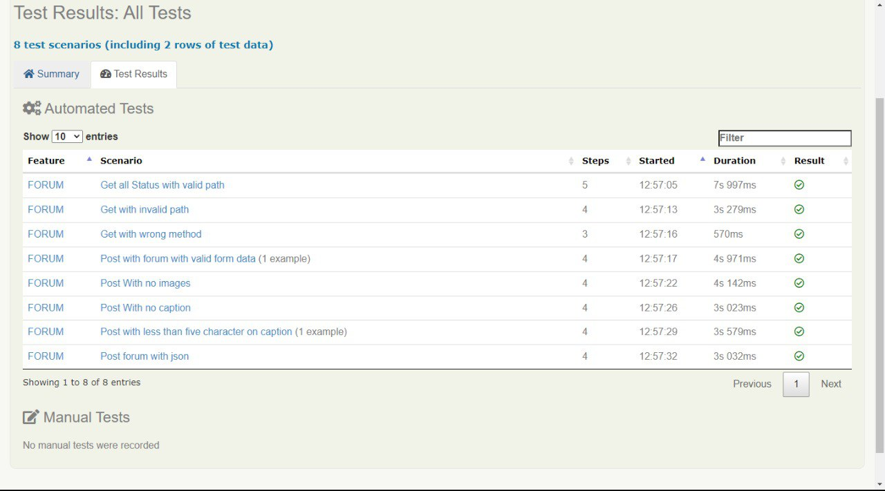

# AutomationTesting-Website-Mentutor

<div align="left">
<br/>
<summary><h1 style="display-inline:block">MENTUTOR APP</h1></summary>
About MENTUTOR APP
"Mentutor is present as a place for teachers to monitor their students both from collecting assignments and by discussing with students through the available forums"


## Link Test Case Manual.
<div>
<a href="https://docs.google.com/spreadsheets/d/112BTHzntiOeodGzL3cI8p_8gOUZZBaHNsRkt0Kauexw/edit#gid=0" target="blank"></a>
<a href="https://docs.google.com/presentation/d/1nPFZad7D1vlXkHDafPNE7DXlvN22LFyRdqorhA2auXo/edit#slide=id.p1" target="blank"></a>
<a href="https://app.swaggerhub.com/apis-docs/NURFATUROHMAN28/Mentutor/1.0.0#/" target="blank"></a>


## Report Test Overall.
<br/>

## Coverage Every Features.
<br/>

</div>
<h2> Tools & Technology Stack. </h2>
<div>
<p>Manual Testing</p>
      <a></a>
      <p>Test Case Management</p>
      <a></a>
      <p>Automation Testing</p>
      
      
      
      
      <!--  -->
      
      
      <p>Management Project</p>
      
</div>


## How To Run Project.
1. Clone use link below
```
$ git clone https://github.com/TimC-Mentutor/AutomationTesting-API-Mentutor.git
```
3. Go to directory
```
$ cd API-Mentutor
```
5. Run the project
```
$ mvn clean verify
```
7. You good to go!
</div>

## Team C Member :
* [Alfian Septy Chandra](https://github.com/Ryouta021) <br> [](https://github.com/Ryouta021)
* [Binti Nayla Wafiroh](https://github.com/inaylalala) <br> [](https://github.com/inaylalala)
* [Izzuddin Faruqi](https://github.com/faruqiizu) <br> [](https://github.com/faruqiizu)
